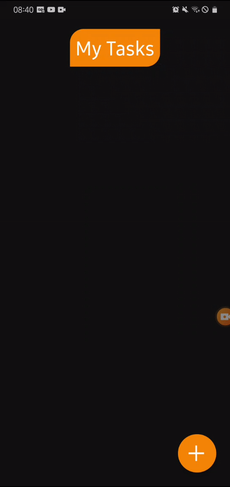

# 

<h1 align="center"> ToDoApp React Native</h1>
<h5 align="center" font-weigth="bold">  A simple, lightweight and functional task application, currently has the task of writing, reading and deleting tasks, which are stored in the permanent memory of the device</h5>

   
  <h6 align="center">Screens on Android</h6>

### Main technologies used
  
 
    
- [Javascript](https://developer.mozilla.org/en-US/docs/Web/JavaScript/) - Javascript is a very popular high-level programming language that can be applied in a variety of scenarios

- [React Native](http://facebook.github.io/react-native/) - React Native is a Javascript framework for building multiplatform mobile application interfaces (Android and IOS) rendering native code 

- [Expo](https://expo.io/) - Expo is an open-source platform for making universal native apps for Android, iOS, and the web with JavaScript and React.

### Requirements to run the application on your machine
  To run, just have Node, React Native and Expo installed on your machine, for that, follow the tutorials below to install them

- [How to install Node](https://nodejs.dev/)

- [How to install React Native](https://reactnative.dev/docs/getting-started)

- [How to install Expo](https://docs.expo.io/get-started/installation/)
### How to run after all requeriments installeds

After having all your environment set up correctly, clone the project repository to a location of your choice on your machine. 
  
Open a terminal inside the project folder and run `npm install` to download project depedences.

After, start the expo with code `expo start`, a developer tools window will be opened in your default browser, note that there is a QR code in it.

Search for `Expo` in your app store, be it PlayStore or AppleStore, and download the expo app, with this application, scan the Qr code and the application will start on your device.
